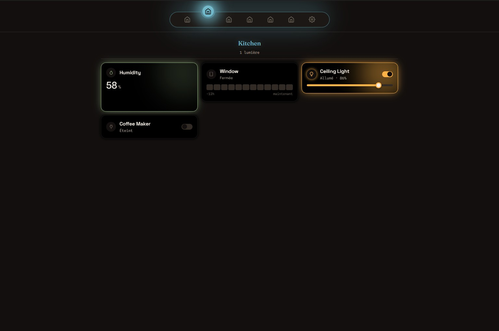
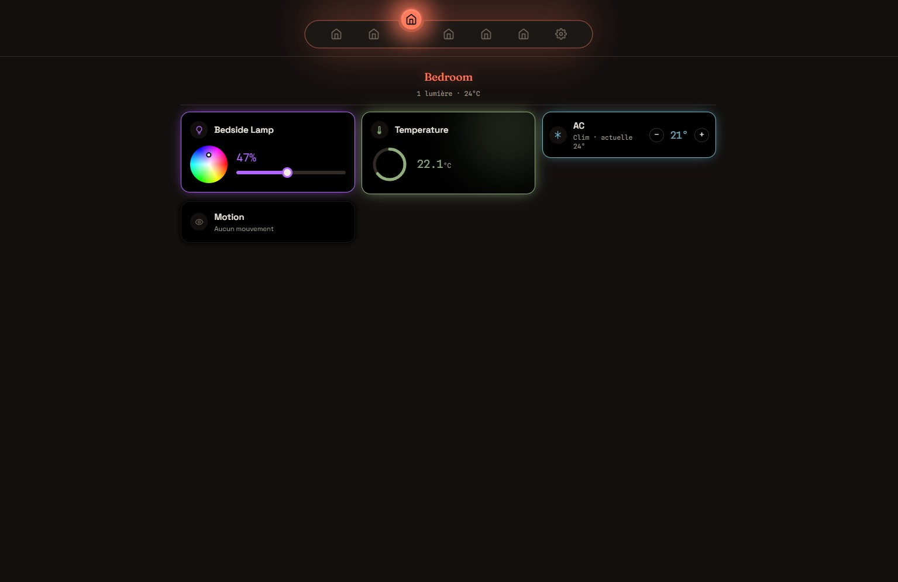
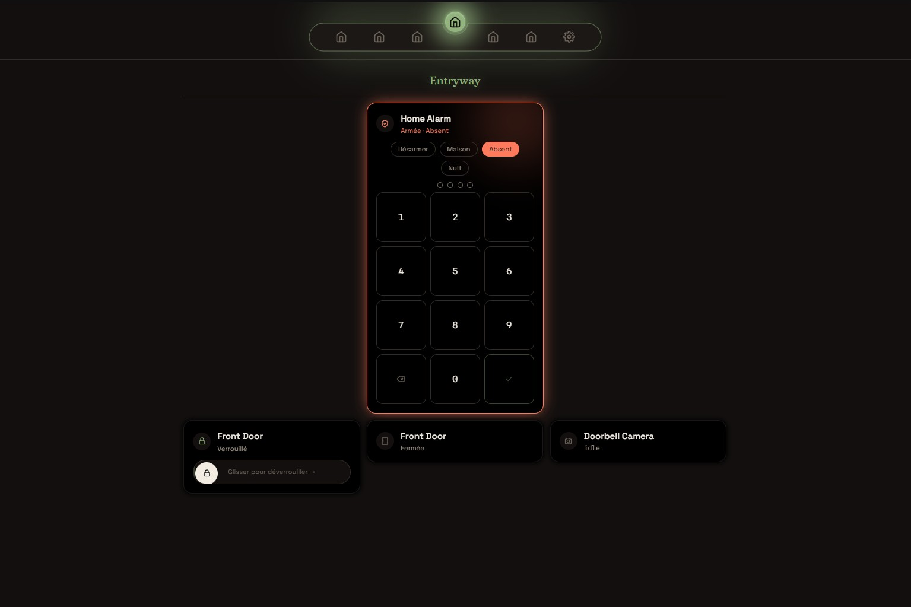
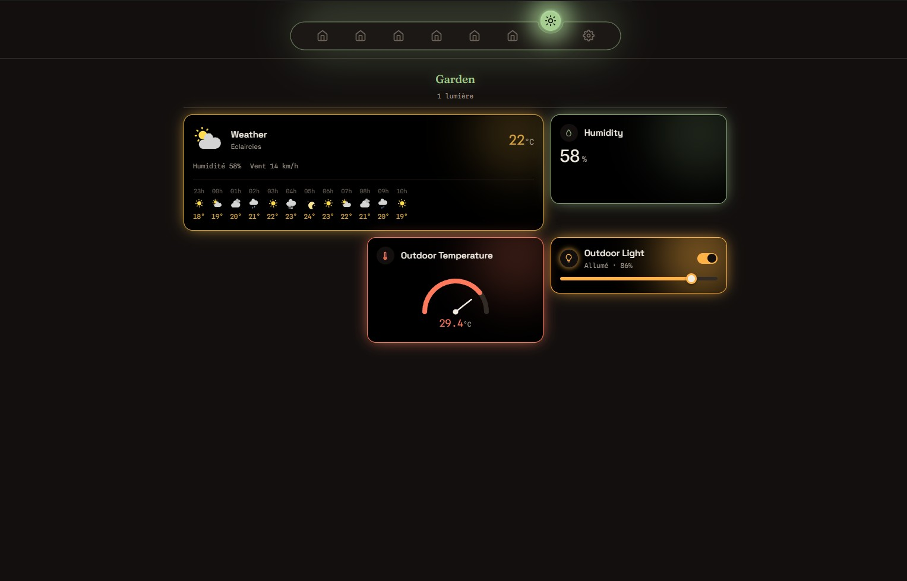
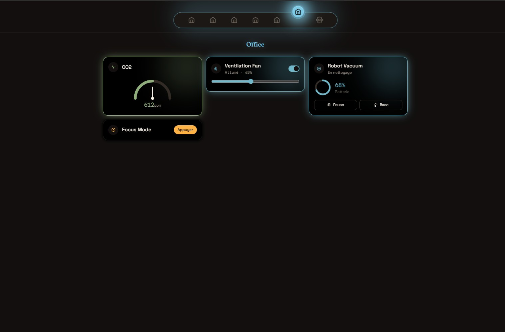
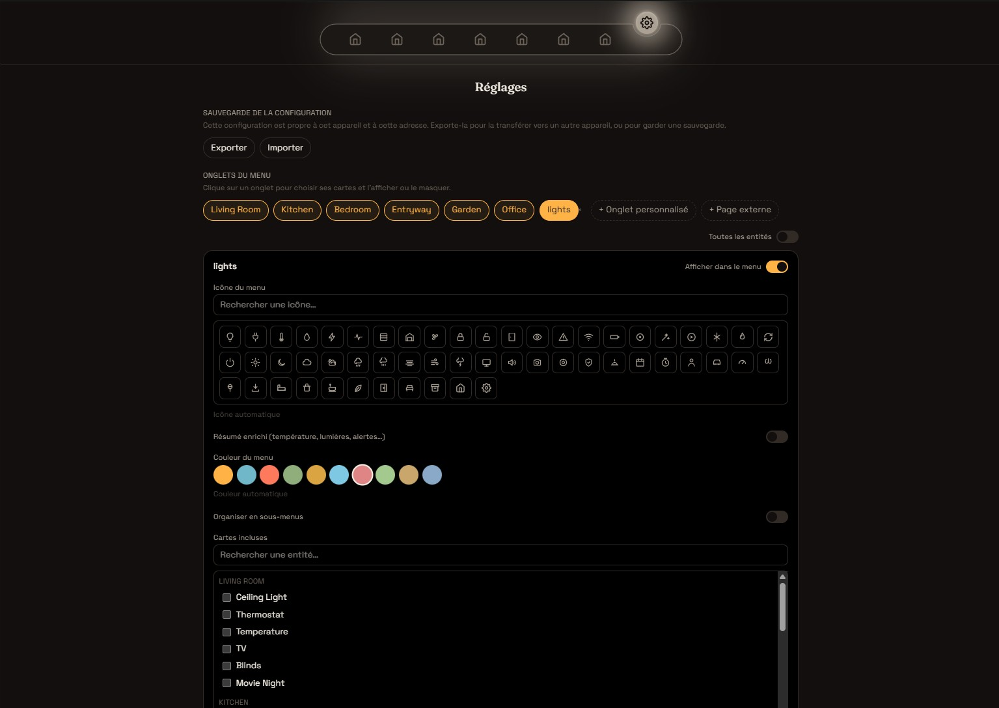

# Dcy Glow Board

*[Version française](README.fr.md)*

A personal, from-scratch dashboard for [Home Assistant](https://www.home-assistant.io/), built independently of Lovelace, talking directly to HA's real-time WebSocket API. No YAML, no backend: everything runs client-side, and every device gets a card designed around what it actually does.

|  |  |  |
|---|---|---|
|  |  |  |

> Screenshots use a made-up demo home (fake rooms and devices, no real data), just to show each card style. The room layout, card choice, and style picked for every card is entirely up to you from the Settings page: nothing here is fixed.

## Why this exists

Lovelace is flexible, but building an interface that *looks* considered (per-domain visual identity, physically meaningful color where a light's glow scales with its brightness and a thermostat looks like a thermostat, layout you fully control by dragging cards around) meant starting from an empty canvas instead of a card framework. This is that canvas.

## Features

- **English/French interface**, switchable anytime from Settings (English by default); device and room names always come from Home Assistant itself, unaffected by this toggle.
- **Automatic room grouping**: reads Home Assistant's own areas/zones; a new area you create in HA shows up here without touching any config.
- **A dedicated card per domain**, each with its own controls and 2 to 5 alternate visual styles, chosen per card in the Settings page:

Full list of supported domains

| Domain | Controls | Style choices |
|---|---|---|
| `light` / `switch` | toggle, brightness, color temp, 8-color palette | Default, Tile, Color wheel |
| `climate` | circular thermostat dial, +/-, mode select | Dial, Compact |
| `sensor` | value + 24h sparkline | Number, Arc, Gauge needle, Thermometer, Ring |
| `cover` | open/stop/close, position slider | Default, Tile (drag-to-position) |
| `fan` | toggle, speed slider, spin animation | - |
| `lock` | lock/unlock | Default, Slide-to-unlock |
| `binary_sensor` | read-only, context-aware icon/label | Default, 12h timeline |
| `button` / `scene` / `script` | single action button | - |
| `weather` | conditions, animated icons (14 states) | Day / Hourly / 7-day forecast |
| `media_player` | play/pause/skip, volume, now playing | Default, Tile (remote-style), Now-playing art |
| `camera` | snapshot preview | Default, Preview (auto-refresh + lightbox) |
| `alarm_control_panel` | arm/disarm with code | Default, Always-visible keypad |
| `vacuum` | start/pause/return, battery | Default, Tile (battery ring) |
| anything else | generic fallback card | - |

- **Fully customizable Settings page** (all client-side, nothing written back to Home Assistant): show/hide tabs, drag-reorder tabs and cards, build custom tabs that pull devices from any room, sub-menus inside a tab, rename any card's display label, pick an icon from a searchable catalog, pick a tab color, resize a card to 1 to 3 grid columns, free-form card positions.
- **"Page externe" tab**: embed any local web page (ESPHome dashboard, Node-RED, Pi-hole, an IP camera's own UI…) full-screen inside the app, in a plain iframe.
- **Config export/import** as JSON: since browser `localStorage` is per-origin, this is how you carry your setup from one device or URL to another.

## Getting started

Two install guides, pick based on how much hand-holding you want:

- **[Quick start](docs/install-quick.md)**: for anyone comfortable with `npm`, Home Assistant add-ons, and who doesn't need every step spelled out.
- **[Detailed guide](docs/install.md)**: step by step, several deployment methods, a troubleshooting section, written for someone who's never done this before.

*(Guides aussi disponibles en français : [rapide](docs/install-quick.fr.md), [détaillé](docs/install.fr.md).)*

## Tech stack

React 19 + TypeScript + Vite, Tailwind CSS v4, `home-assistant-js-websocket` for the live connection. No backend, no build-time secrets: the HA URL and long-lived access token are entered once in the app and stored in the browser's `localStorage`.

## Status

This is a personal project, actively used and evolving, not a polished 1.0. See [DISCLAIMER.md](DISCLAIMER.md) before connecting it to devices you care about.

**What's actually tested**: used daily against the author's real Home Assistant instance, lights/switches, climate, sensors, binary sensors, buttons/scenes/scripts, weather, media players (confirmed live against an MPD player through Music Assistant), custom tabs, drag-and-drop, settings, config export/import, and the external-page iframe tab.

**Dev-preview only, not yet verified on real hardware**: covers, fans, locks, camera, alarm control panel, and vacuum cards. They were built and checked against the app's built-in developer preview (simulated entities, see `USE_DEV_PREVIEW` in `src/main.tsx`), but the author doesn't own matching devices to confirm them against the real thing. If you try them on real hardware, an issue report on what did or didn't work would be genuinely useful.

## Credits

- **Animated weather icons**: [caule-themes-pack-1](https://github.com/ricardoquecria/caule-themes-pack-1) by Ricardo Correia (MIT license), icons originally created by amCharts.
- **Navigation menu inspiration**: the room-switcher concept (sliding glow pill, "gelatine neon" style) is inspired by a [TikTok video by @code_candy](https://www.tiktok.com/@code_candy/video/7671047586928954646). The implementation is an original React/TypeScript build for this project; nothing was copied from the video.
- **Fonts**: Fraunces, Space Grotesk, and Spline Sans Mono via [Fontsource](https://fontsource.org/) (SIL OFL license).
- **Home Assistant connectivity**: [home-assistant-js-websocket](https://github.com/home-assistant/home-assistant-js-websocket), the official library.

## Support this project

If this dashboard has been useful to you, you can support its development:

- [GitHub Sponsors](https://github.com/sponsors/dcybeldesign)
- [Buy Me a Coffee](https://buymeacoffee.com/dcybeldesign)

## License

[MIT](LICENSE). See also [DISCLAIMER.md](DISCLAIMER.md) for use-at-your-own-risk terms specific to a dashboard that controls real devices.
